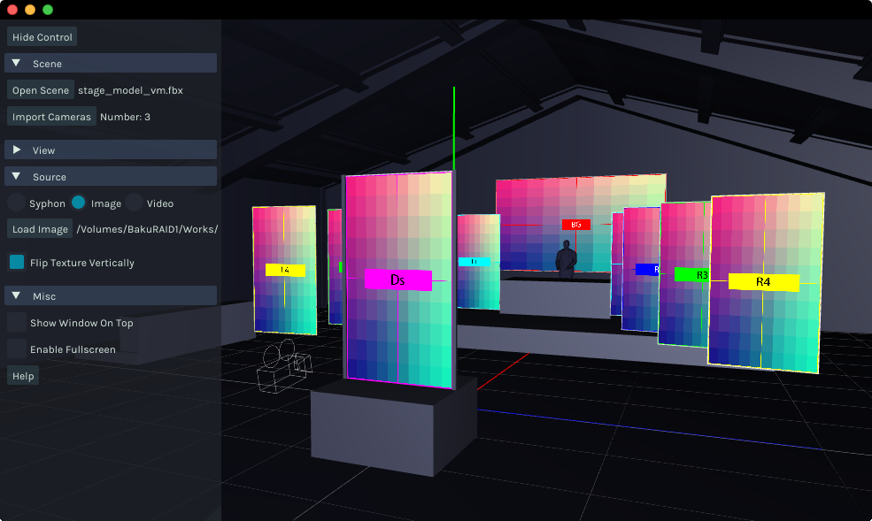
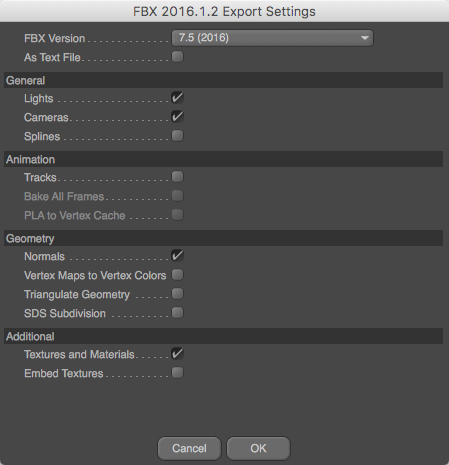

# Virtual Mapper <!--VERSION-->v<!--/VERSION-->

[Download](https://github.com/baku89/VirtualMapper/releases)

**Important: Latest version only supports macOS. Please use [v0.9](https://github.com/baku89/VirtualMapper/releases/tag/v0.9) if you use Windows.**

## About

Utility tool for projection mapping. You can preview 3d projected image in realtime while editing a net of screen. This app can receive image from applications supports [Syphon](http://syphon.v002.info/) or [Spout](http://spout.zeal.co/) (ex: After Effects, VDMX, Arena). This software is made using [openFrameworks](http://openframeworks.cc/).

Develped by [Baku Hashimoto](http://baku89.com)

## Instructions

### 1. Export FBX Scene

Virtual Mapper will interpret a scene file with following rules:

 - All meshes whose name begins with `screen` will be interpreted as Screen and the software will replace its surface with a texture specified in **Source** menu.
 - Screen meshes must have UV coordinates.
 - All meshes whose name begins with `guide` will be interpreted as Guide.
 - Other meshes will be interpred as Stage.
 - Cameras will be imported and users can toggle them. (Orthographic camera does not supported currently.)
 - The software supports only diffuse and luminance color of material.
 - The software does not support animation, light, spline, and embed texture in FBX format.

#### Example: Cinema4D

Setup scene such like this:

Then export FBX from **File > Export > FBX (\*.fbx)**.

### 2. Setup an sender application

#### macOS (via Syphon)

There's several plugins for softwares below:

* After Effects: [AESyphon plugin](http://tobiasebsen.dk/experiments/aesyphon/)
* VDMX: [Syphon Output - VDMX](http://vdmx.vidvox.net/tutorials/syphon-output)

Other supporting softwares is here: [Syphon official site](http://syphon.v002.info/).

#### Windows (via Spout)

You can download plugins from [Spout official site](http://spout.zeal.co/).

* After Effects: [benkuper/Spout-After-Effects](https://github.com/benkuper/Spout-AfterEffects)

### 3. Launch Virtual Mapper

* Launch sender application and Virtual Mapper.
* Load the FBX file from **Scene > Open Scene**
* Select the applopriate input source.

#### NOTE: When you could not open the app and find below alert

Please open **System Preferences > Security & Privacy**, and then click in **Open Anyway**.

<!--I uploaded [tutorial (when using After Effects as sender on mac)](https://vimeo.com/117640423).-->

## License

Virtual Mapper is published under a MIT License. See the included [LISENCE file](./LICENSE).

## TODO

* Windows support
* retina display support
* add rendering options
* add "export to image / video" feature
* OSC / MIDI controlling feature
